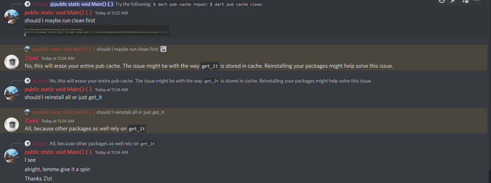

## PROBLEM

```markdown
"Could not find a file named "pubspec.yaml" in "C:\Users\paula\AppData\Local\Pub\Cache\hosted\pub.dartlang.org\get_it-7.2.0"."
```
This error showed up after many events, but interestingly, this was not the first time.
It had shown up a couple days back but not taking the days into account, it showed up when
I opened a project I was working on, which was using the `get_it` package.

I'd forgotten how I got rid of the error then, but I believe I'd only switched my
flutter channel a few days prior, and it was on beta, so, I simply switched to master,
ran `flutter upgrade` and was soon rid of the error

Yesterday however, I'd opened up the JVM project, and all files were red, as it
usually is after you clone a project from github, or open up a project that isn't yours
until you ran `flutter pub get`, then everything gets sorted. hmm

**OR SO I THOUGHT**

This time, It was different, I'd run flutter pub get, but kept getting hit with this
error, and it was preventing the packages from being got. so, I thought...hmm this
should be an easy fix. just do what I did last time, so, I researched a little because
I was already on master channel from that last fix, so, I checked online to see if
any other channel was better, long story short, I switched to all channels, but wasn't
working.

**THINGS I'D DONE**

- Updated Flutter
- Updated Android Studio from chipmunk to dolphin
- Switched channels

These things I remember to be the last events I'd carried out, so, I couldn't tell what 
exactly was causing it, or what to reverse. I stumbled for a long time, until a few 
minutes ago. 

2022, October 7th. 11:19, I'd posted on the flutter-mobile-help channel in the 
AppBrewery Flutter server


less than a minute later, Ziyad replied


I was ecstatic, I ran the first command, and got hit with the error
and a freeze




But I couldn't do anything at that point tho, because that
first command, hadn't completed yet. So before trying out any
other suggestions, I had to wait for it to complete, I waited
and waited and when it had finally completed, about an hour
later, I simply run his second command and everything went
silent. Oh I loved the silence. It was peaceful


## SOLUTION

```commandline
 dart pub cache repair
 dart pub cache clean
```