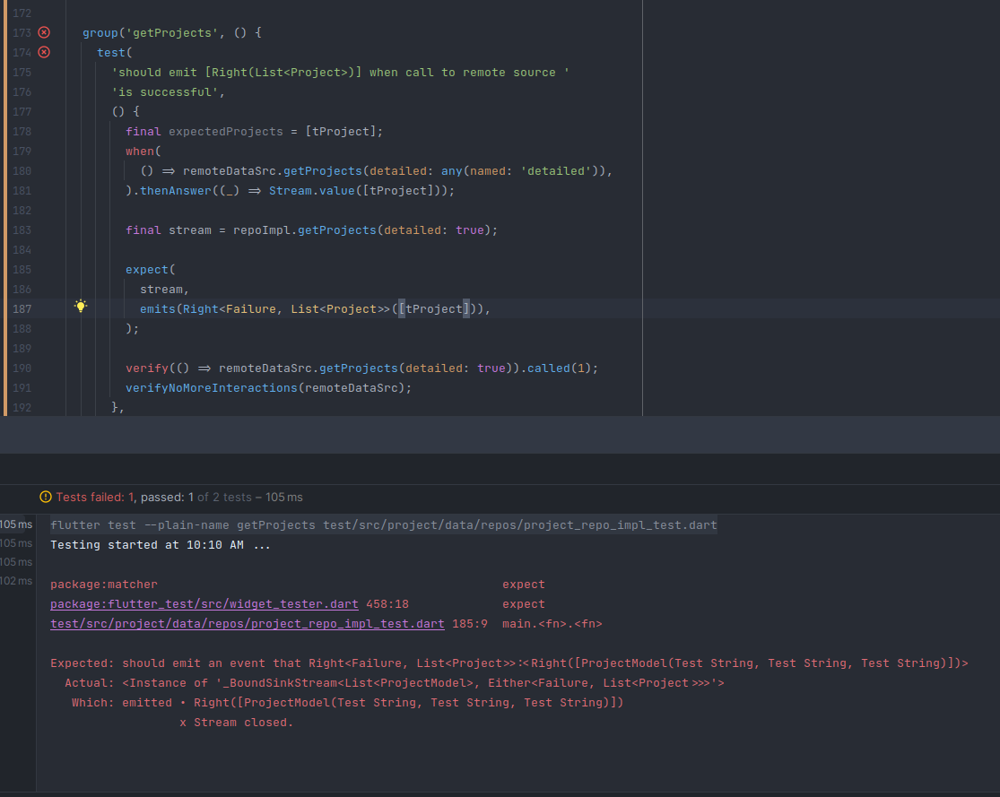

## PROBLEM

I got an error while writing a test for my Stream returning Repository Implementation,
I was expecting that the resulting Stream `emits` the `test data` I'd provided earlier
to the `stub`



## SOLUTION

I found out the issue was passing the list literal to the stub and the assertion,
in each case, a new instance was given, causing value equality to fail as it does
for collections in dart, very weird value equality lists have, you usually need to
use a different package just to get collection equality to work, I use the [collection](https://pub.dev/packages/collection)
package from the [dart team](https://pub.dev/publishers/dart.dev/packages).

My solution was as you see in the screen grab up top, to declare the expected list
before hand and pass the same instance of it to both the stub and the assertion.

```dart
test(
      'should emit [Right(List<Project>)] when call to remote source '
      'is successful',
      () {
        final expectedProjects = [tProject]; // where tProject was defined at the top
        when(
          () => remoteDataSrc.getProjects(detailed: any(named: 'detailed')),
        ).thenAnswer((_) => Stream.value(expectedProjects));

        final stream = repoImpl.getProjects(detailed: true);

        expect(
          stream,
          emits(Right<Failure, List<Project>>(expectedProjects)),
        );

        verify(() => remoteDataSrc.getProjects(detailed: true)).called(1);
        verifyNoMoreInteractions(remoteDataSrc);
      },
    );

```
