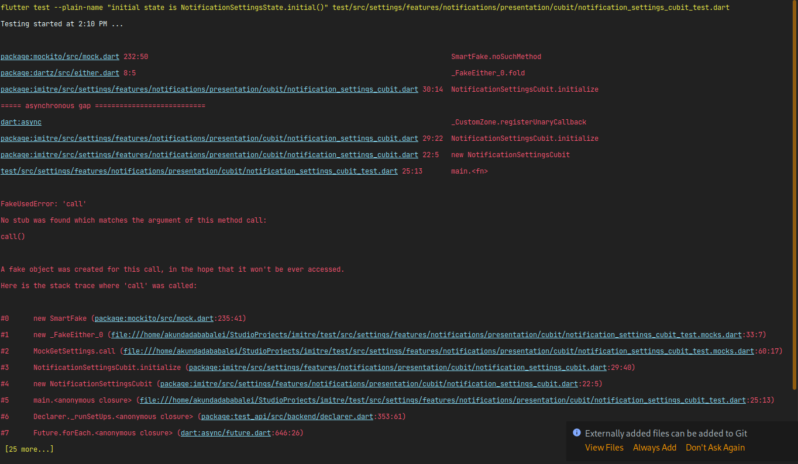

## PROBLEM

I got this error when I was writing a test for my cubit.

```dart
void main() {
  late NotificationSettingsCubit cubit;
  late MockGetSettings mockGetSettings;
  late MockSaveSettings mockSaveSettings;
  const tSettingsModel = SettingsModel(
    isCallEnabled: true,
    isNotificationEnabled: true,
    isSoundEnabled: false,
  );
  setUp(() {
    mockGetSettings = MockGetSettings();
    mockSaveSettings = MockSaveSettings();
    when(mockGetSettings()).thenAnswer(
          (_) async => const Right(tSettingsModel),
    );
    cubit = NotificationSettingsCubit(
      getSettings: mockGetSettings,
      saveSettings: mockSaveSettings,
    );
  });

  blocTest<NotificationSettingsCubit, NotificationSettingsState>(
    'initial state is NotificationSettingsState.initial()',
    build: () => cubit,
    expect: () => [NotificationSettingsState.initial()],
  );
}
```

The error is:




and most of the links were referencing the call to the useCase happening in the bloc, but I don't have any useCase 
in my bloc, I have it in the cubit.


**Cubit**
```dart
class NotificationSettingsCubit extends Cubit<NotificationSettingsState> {
  NotificationSettingsCubit({
    required GetSettings getSettings,
    required SaveSettings saveSettings,
  })  : _getSettings = getSettings,
        _saveSettings = saveSettings,
        super(NotificationSettingsState.initial()) {
    initialize();
  }

  final GetSettings _getSettings;
  final SaveSettings _saveSettings;

  Future<void> initialize() async {
    final settings = await _getSettings();
    settings.fold(
      (l) => emit(state),
      (r) => emit(
        state.copyWith(
          notificationEnabled: r.isNotificationEnabled,
          soundOn: r.isSoundEnabled,
          receiveCall: r.isCallEnabled,
        ),
      ),
    );
  }
}
```

**UseCase**
```dart

class GetSettings extends UseCaseWithoutParams<Settings> {
  const GetSettings(this._repo);

  final NotificationsSettingsRepo _repo;

  @override
  FunctionalFuture<Settings> call() => _repo.getSettings();
}
```


## SOLUTION

I noticed I wasn't rerouting the call to the mock useCase and was letting it call
the original useCase when my cubit was initialized in the setUp method.

```dart
cubit = NotificationSettingsCubit(
      getSettings: mockGetSettings,
      saveSettings: mockSaveSettings,
    );
```

so, I simply used the when method to reroute the call to the mock useCase.

```dart
  setUp(() {
    mockGetSettings = MockGetSettings();
    mockSaveSettings = MockSaveSettings();
    when(mockGetSettings()).thenAnswer(
          (_) async => const Right(tSettingsModel),
    );
    cubit = NotificationSettingsCubit(
      getSettings: mockGetSettings,
      saveSettings: mockSaveSettings,
    );
  });
```