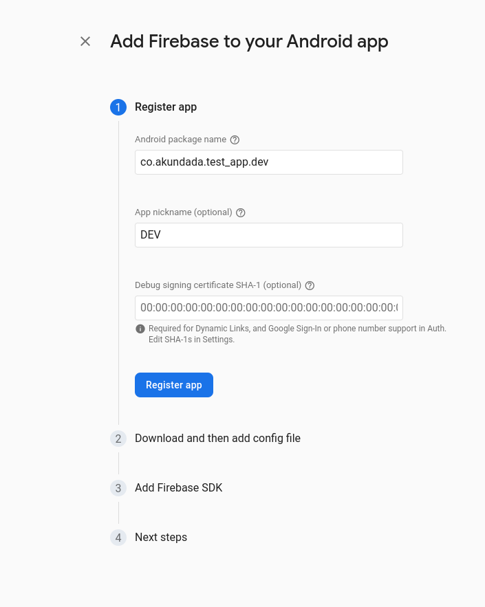
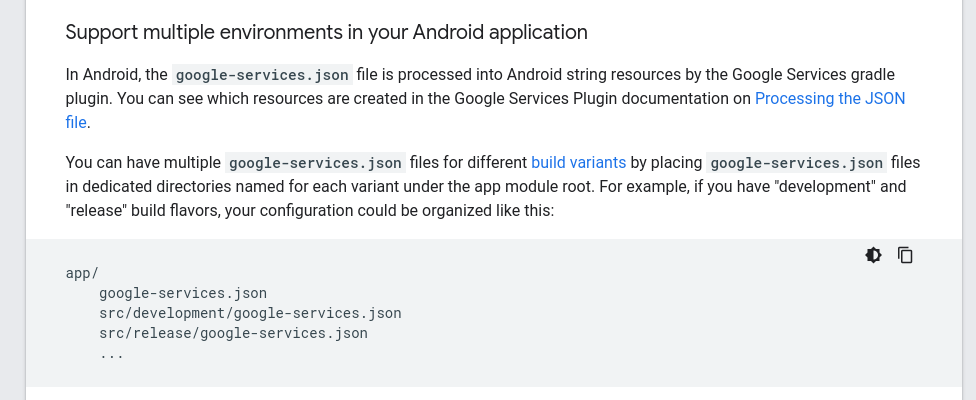

## PROBLEM 

```commandline
Launching lib/main_development.dart on SM A125F in debug mode...
Running Gradle task 'assembleDevelopmentDebug'...

FAILURE: Build failed with an exception.

* What went wrong:
Execution failed for task ':app:processDevelopmentDebugGoogleServices'.
> No matching client found for package name 'co.benaiah.benaiah_mobile_app.dev' in /home/akundadababalei/StudioProjects/benaiah_mobile_app/android/app/google-services.json

* Try:
> Run with --stacktrace option to get the stack trace.
> Run with --info or --debug option to get more log output.
> Run with --scan to get full insights.

* Get more help at https://help.gradle.org

BUILD FAILED in 20s
Exception: Gradle task assembleDevelopmentDebug failed with exit code 1
```

Definitely a flavour issue. Since firebase doesn't automatically add config files
for your other flavours, if your project is configured for a complex/flavoured environment.


# SOLUTION
https://firebase.google.com/docs/projects/multiprojects

- Go to your firebase console and open your project, then go to it's project settings.
- Go to `your apps` section and add a new app(do this for each flavour/environment)



- Download the `google-services.json` file for each environment/flavour and put them in the correct environment 
- directory in your project's `android/app/src/...`



- After this, run `flutter clean && flutter pub get` just to fulfill all righteousness.